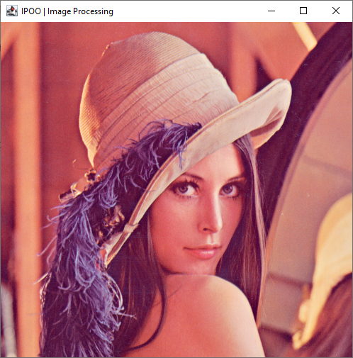
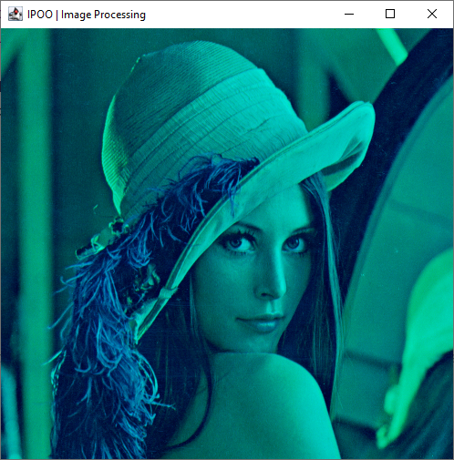
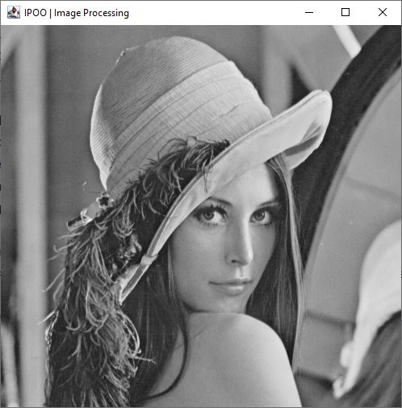
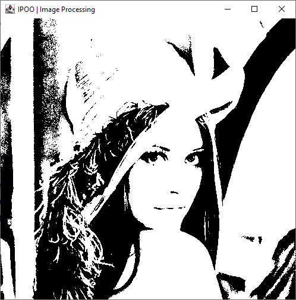

# Lab 4 (2) - Processamento de Imagens

## Racional

Uma imagem digital colorida pode ser representada como um array 3D, onde cada dimensão tem um significado específico.


**Estrutura do array 3d**:
- A primeira dimensão (`width`) corresponde à largura da imagem, i.e., número de colunas;
- A segunda dimensão (`height`) corresponde à altura da imagem, i.e., número de linhas, e;
- A terceira dimensão (componente RGB) contém a intensidade de cada cor básica.    
    - RGB significa *Red* (Vermelho), *Green* (Verde) e *Blue* (Azul). Cada pixel da imagem é formado pela combinação dessas três cores.
    - **A intensidade de cada cor varia de 0 a 255**, onde 0 significa ausência da cor e 255 é a intensidade máxima.
        - Consequentemente, `[0, 0, 0]` representa a cor "preto" puro e `[255, 255, 255]` a cor "branco" puro.

:bulb: Note que nas coordenadas de ecrã (e também da imagem), as coordenadas `(0, 0)` correspondem ao pixel no topo esquerdo.

Em Java, podemos representar uma imagem colorida como um array tridimensional de inteiros.

```java
int[][][] image = {
                    {{255, 0, 0},   {0, 255, 0},   {0, 0, 255}},
                    {{255, 255, 0}, {255, 0, 255}, {0, 255, 255}}
                  };
```

Neste exemplo:
- A imagem tem 3 pixels de largura e 2 de altura
- Cada pixel é representado por um array de 3 números (RGB)
- O primeiro pixel [255, 0, 0] é vermelho puro
- O último pixel [0, 255, 255] é ciano (mistura de verde e azul)

**Exemplo de operações**:

A partir de um array tridimensional `image`:

- `int width = image.length;` permite obter a largura da imagem;
- `int height = image[0].length;` permite obter a altura da imagem;
- `int[] pixel00 = image[0][0];` permite obter o array (tamanho 3) do pixel na posição `(0, 0)`.
- ```java
  // Atribuir a cor "branca" ao pixel em (0, 0)
  image[0][0][0] = 255;
  image[0][0][1] = 255;
  image[0][0][2] = 255;

  // Note que a instrução seguinte NÃO É POSSÍVEL FAZER após a inicialização
  image[0][0] = {0, 0, 0}; // erro sintático
  ```

## Clonagem de repositório GitHub (how-to)

1. Obter o URL do Repositório
    - Acesse a página do repositório no GitHub que deseja clonar (no caso deste laboratório, é este endereço que está a visualizar).
    - Clique no botão verde `Code`.
    - Copie o URL HTTPS do repositório.
2. Abrir o IntelliJ IDEA e iniciar o processo de Clonagem
    - Na tela de boas-vindas, clique em `Get from Version Control`.
    - Se já tiver um projeto aberto, vá para `File > New > Project from Version Control`.
3. Configurar a Clonagem
    - Na janela que se abre, selecione "Git" como o sistema de controle de versão.
    - Cole o URL do repositório que você copiou do GitHub no campo "URL".
    - Escolha o diretório local onde deseja salvar o projeto clonado.
4. Clonar o Repositório
    - Clique no botão "Clone".
    - O IntelliJ IDEA começará a clonar o repositório.
    - Aguarde até que o processo de clonagem seja concluído.
5. Configurar o Projeto
    - Após a clonagem, o IntelliJ IDEA perguntará se você deseja abrir o projeto.
    - Clique em "Yes" para abrir o projeto.
    - O IDE detectará automaticamente a estrutura do projeto e configurará as dependências necessárias.
6. Verificar a Clonagem
    - Após a abertura do projeto, verá a estrutura de arquivos no painel esquerdo.
    - O IntelliJ IDEA também configurará automaticamente o controle de versão Git para o projeto.
    - Agora tem uma cópia local do repositório GitHub no seu IntelliJ IDEA, pronta para trabalhar.

[:warning: (how-to gerado com auxílio de perplexity.ai)]

## Programa inicial

Execute o programa em `EmptyFilter.main()`. Deverá visualizar a janela principal do programa com a imagem "base". Trata-se de uma imagem `512 x 512` bastante conhecida no domínio do processamento de imagem - "[Lenna](https://en.wikipedia.org/wiki/Lenna)".



## Exercícios

Como exercício, propomos a criação de diferentes "filtros" de imagens, através do processamento dos pixels desta imagem.

:bulb: Para criar um novo filtro faça copy/paste da classe `EmptyFilter`; no _wizard_ dê o nome do filtro respetivo proposto. Irá ficar com uma cópia do programa onde deverá implementar a função `processPixels`:

```java
public class EmptyFilter {
    public static void main(String[] args) {

        PixelProcessor filter = new PixelProcessor() {
            @Override
            public void processPixels(int[][][] image) {
                // Your code here
            }
        };

        // Create an instance of the pt.ipoo.filters.ImageDisplay class, passing the pixel processor
        new ImageDisplay(filter);
    }
}
```

Poderá não ter tempo de implementar em aula todos os filtros (pode/deve terminar em casa), pelo que serão apresentados por ordem de dificuldade estimada (para programadores iniciantes). Mas pode escolher os que quer implementar em aula.

### Filtros propostos

#### No Red Channel | Fácil 🟢

Deverá percorrer todos os pixels da imagem e colocar a componente Red com o valor `0`. Isto eliminará o "canal" vermelho.

Resultado esperado:



#### Grayscale | Fácil 🟢

Este filtro transforma a imagem em tons de cinzento. Para tal deverá percorrer todos os pixels da imagem e atribuir a todas as componentes o mesmo valor de acordo com a seguinte formula:

```java
int grayscale = (int) (0.299 * red + 0.587 * green + 0.114 * blue);
```

Resultado esperado:



#### Threshold | Fácil 🟢

Este filtro executa um género de mapeamento binário a cada pixel, i.e., cada pixel terá a cor "branco puro" ou "preto puro", mediante um valor _threshold_ (limite) especificado.

É necessário calcular o valor _grayscale_ para cada pixel (análogo ao filtro anterior) e atribui a cor final ao pixel de acordo com:

```console
IF grayscaleValue >= threshold THEN
    pixel is white
ELSE
    pixel is black
END IF
```

onde `threshold` é uma constante. 

Resultado esperado, onde _threshold_ está definido com o valor `100`:



#### Mirror | Médio 🟠

Este filtro resultará no "espelhamento" horizontal da imagem. Existem vários "algoritmos" equivalentes para obter este resultado, mas sugerimos o seguinte (em linguagem natural):

- Para cada linha da imagem:
  - Criar uma nova linha copiando os pixels da imagem original por ordem inversa
  - Substituir a linha original pela linha invertida

Resultado esperado:


#### Blur | Díficil 🔴

Trata-se de um **filtro de convolução** que permite "suavizar" uma imagem. Um filtro de convolução funciona como apresentado na seguinte animação:


Cada pixel é calculado como sendo a média dos pixels (média por componente) na sua vizinhança imediata. Um [kernel](https://en.wikipedia.org/wiki/Kernel_(image_processing)) comum para este efeito é:

$$
\frac{1}{9} \times 
\begin{bmatrix}
1 & 1 & 1 \\
1 & 1 & 1 \\
1 & 1 & 1
\end{bmatrix}
$$

Os pixels "exteriores" permanecem inalterados, mas cada um dos "interiores" consiste na sua média com os pixels adjacentes.

Resultado esperado:


